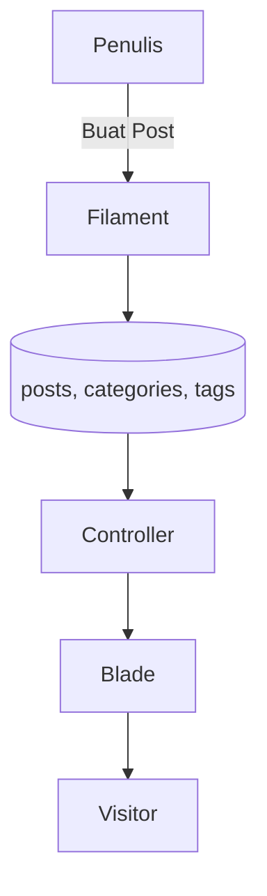

# Dokumentasi Gerindra Web Management System

Dokumen ini merangkum arsitektur, modul administrasi, dan alur kerja aplikasi **Gerindra Web Management System**. Sistem dibangun dengan **Laravel 12** dan **Filament v4** sebagai panel admin.

---

## 1. Arsitektur Aplikasi
- **Frontend**: Blade + Tailwind CSS + Alpine.js.
- **Backend**: Laravel 12, Eloquent ORM.
- **Admin Panel**: Filament v4.
- **Database**: MySQL/MariaDB.
- **Media**: Laravel Filesystem (disk `public`) + optimasi varian gambar.

```
User -> Frontend (Blade) -> Controller -> Model (Eloquent) -> Database
Admin -> Filament Panel -> Resource/Form -> Model -> Database
```

---

## 2. Peran Pengguna
| Role | Akses |
| --- | --- |
| Admin | Semua modul, pengaturan situs, manajemen menu & homepage. |
| Editor | Kelola konten (post, pages) miliknya & penulis lain. |
| Penulis | Buat / edit post milik sendiri. |

---

## 3. Modul Filament
### 3.1 Post Management
- Multi kategori (utama + tambahan).
- Tag dan status (draft/scheduled/published).
- Upload thumbnail -> varian WebP otomatis.
- Statistik views (`post_views`) untuk widget "populer".

### 3.2 Pages
- Konten rich text dengan toolbar lengkap.
- Upload PDF (`pages/attachments`) dan viewer langsung di frontend.
- Thumbnail opsional.

### 3.3 Menu Builder
- Mendukung hierarki bertingkat (parent → child → sub-child).
- `Gerindra` sebagai menu utama, `Profil` sebagai submenu yang memuat 10 halaman seeded.
- Sort order menentukan urutan tampil.

### 3.4 Homepage Settings
Form "Homepage Settings" menyediakan:
- **Hero Slider** (gambar, judul, tombol, URL).
- **Custom Buttons** (menu pintasan di bawah slider).
- **Konten Tabs** (judul + rich text) dengan tinggi dinamis dan tampilan transparan.
- **Susunan Pengurus** (foto, jabatan, nama).
- **Kategori Berita** (memilih 3 kategori untuk blok khusus).

### 3.5 Company Profile
- Nama perusahaan, alamat, kontak, sosial media, visi & misi.
- Seed awal: `DPP Partai Gerindra`, alamat Ragunan, email `ppid@gerindra.id`.

### 3.6 Site Settings
- Nama situs, deskripsi, logo, favicon, media sosial default.

### 3.7 Ad Settings
- Letak header, sidebar, bawah post, footer.
- Script HTML/JS bebas (misal Google AdSense).

---

## 4. Seeder & Data Dummy
Perintah `php artisan db:seed` mengisi data berikut:
- **SiteSettingsSeeder** – identitas situs.
- **CompanyProfileSeeder** – profil organisasi.
- **PageSeeder** – 10 halaman profil + halaman umum.
- **NewsPostSeeder** – 13 berita resmi, kategori, tag, dan menu `Gerindra → Profil`.
- **CategorySeeder & RolesSeeder** – kategori dasar & role pengguna.

Anda dapat menjalankan seeder spesifik, misalnya:
```bash
php artisan db:seed --class=NewsPostSeeder
```

---

## 5. Alur Konten Berita

- Post memiliki relasi `categories()` dan `tags()`.
- URL berita: `/posts/{tahun}/{bulan}/{slug}`.
- `PopularPosts` service mengagregasi view berdasarkan periode (hari/minggu/bulan).

---

## 6. Struktur Direktori Penting
```
app/
 ├── Filament/Pages        # Halaman pengaturan khusus
 ├── Filament/Resources    # Resource CRUD Filament
 ├── Http/Controllers      # Controller frontend
 └── Models                # Model Eloquent

resources/views/
 ├── home.blade.php        # Halaman utama
 ├── pages/show.blade.php  # Halaman statis + viewer PDF
 ├── partials/             # Header, footer, navigation
 └── post/                 # Kartu, detail berita, dsb

database/seeders/
 ├── PageSeeder.php
 ├── NewsPostSeeder.php
 ├── CompanyProfileSeeder.php
 └── ...
```

---

## 7. Workflow Pengelolaan Konten
1. **Berita**: Filament → Posts → Create/Edit. Pilih kategori utama (urutan pertama) + kategori tambahan jika diperlukan.
2. **Halaman Profil**: Filament → Pages. Unggah PDF jika ada dokumen pendukung.
3. **Menu**: Filament → Menus. Gunakan drag & drop untuk mengurutkan atau memindahkan submenu.
4. **Homepage**: Filament → Homepage Settings. Isi slider, tombol, tabs, dan pengurus.
5. **Company Profile**: Filament → Company Profile Settings.
6. **Iklan**: Filament → Ad Settings (tempel script HTML sesuai lokasi).

---

## 8. Tips & Best Practice
- Selalu jalankan `php artisan optimize:clear` setelah mengubah konfigurasi/seed penting.
- Gunakan `php artisan queue:work` saat upload gambar agar varian WebP dibuat otomatis.
- Simpan file PDF hanya pada halaman yang membutuhkan; ukuran file besar bisa menambah waktu muat.
- Perbarui menu setelah menambah halaman baru agar struktur navigasi tetap konsisten.

---

## 9. Troubleshooting
| Masalah | Penyebab | Solusi |
| --- | --- | --- |
| Gambar tidak muncul | Symbolic link belum dibuat | `php artisan storage:link` |
| Menu 403 di Filament | Role tidak sesuai | Pastikan user memiliki role `admin` / `editor` sesuai akses |
| PDF tidak tampil | File tidak ditemukan atau bukan `application/pdf` | Periksa `storage/app/public/pages/attachments` dan tipe file |
| Statistik tidak update | Queue tidak berjalan | Jalankan `php artisan queue:work`

---

## 10. Kontak & Kontribusi
- Report issue / feature request melalui GitHub Issues.
- Pull request dipersilakan dengan mengikuti standar PSR-12 & konvensi commit.

**DPP Partai Gerindra – Gerindra Web Management System**
